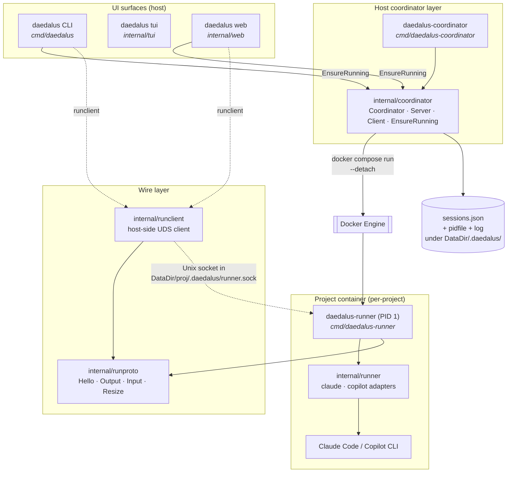
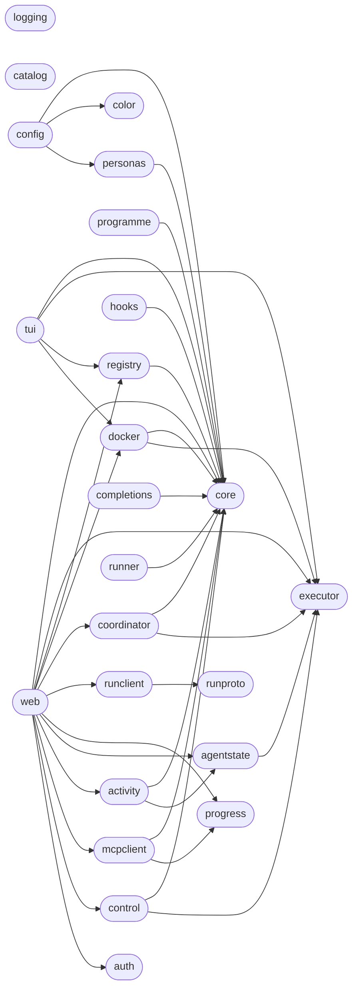
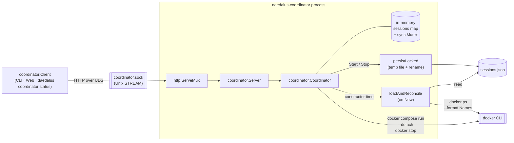

# Architecture

## Overview

Daedalus wraps AI coding agents (Claude Code, Copilot CLI) in Docker containers for autonomous operation. It provides four surfaces (CLI, TUI, Web, daemon) over a shared Go core and a per-container runner process.

The **runner path** is the single launch path — each project runs a `daedalus-runner` PID-1 binary inside its container that fans PTY I/O out over a Unix socket. A host-side `daedalus-coordinator` daemon owns session lifecycles, and all UIs discover sessions through its HTTP-over-UDS API.

## High-level components



Solid edges: coordinator lifecycle control. Dashed edges: PTY I/O relay.

## Modules

### `core/` — pure logic (zero I/O)

| File | Contents |
|---|---|
| `config.go` | `Config` struct, `ValidTargets()`, `IsValidTarget()`, `Image()`, `ContainerName()`, `CacheDir()`, `RunnerSocketPath()`, `SkillsDir()`, `ApplyRegistryEntry()` |
| `appconfig.go` | `AppConfig` (incl. `ContainerPrefix`, `ImagePrefix`), `ApplyAppConfig()` |
| `runner.go` | `HookConfig`, `RunnerProfile`, `LookupRunner()`, `LookupBuiltinRunner()`, `ResolveRunnerName()` |
| `activity.go` | `ActivityState`, `ActivityInfo` — three-state activity model |
| `persona.go` | `PersonaConfig`, `PersonaOverlay`, `PersonasDir()`, `ValidatePersonaName()` |
| `project.go` | `RegistryData`, `ProjectEntry`, `SessionRecord`, `ProjectInfo` |
| `command.go` | `BuildRunnerArgs()`, `BuildExtraArgs()`, `RunnerVolumeArgs()` |
| `skills.go` | `StarterSkills()` — embedded starter skill files |
| `programme.go` | `Programme`, `DependencyEdge`, `DependencyGraph`, `TopologicalSort()`, `DetectCycles()` |
| `sprint.go` | `Sprint`, `SprintItem`, `SprintStatus` — SPRINTS.md data model |
| `backlog.go` | `BacklogItem`, `ParseBacklog()` |
| `roadmap.go` | `ParseSprints()`, `ParseRoadmap()` (legacy alias) |
| `time.go` | `NowUTC()`, `ParseUTC()`, `RelativeTime()` |

### `cmd/` — binaries

| Binary | Purpose |
|---|---|
| `daedalus` | Main CLI. `main.go` dispatches to 15 topic files (`build.go`, `launch.go`, `resolve.go`, `clone.go`, `config_cmd.go`, `usage.go`, `list.go`, `persona.go`, `runners.go`, `programmes.go`, `skills.go`, `coordinator.go`, `attach.go`, `banner.go`). Also owns TUI/Web startup and the runner-attach helper. |
| `daedalus-coordinator` | Host-side daemon. Constructs `coordinator.Coordinator` with `SessionsFile` set, binds `coordinator.NewServer(...)` on the Unix socket, handles SIGINT/SIGTERM for graceful shutdown. |
| `daedalus-runner` | In-container PID-1. Owns the PTY, fans output to any number of connected socket clients, resolves the agent adapter via `internal/runner`. |
| `skill-catalog-mcp` | MCP server (stdio) with 8 tools for skill catalog CRUD. |
| `project-mgmt-mcp` | MCP server (stdio) with 4 tools for project progress / vision / version + roadmap parsers. |
| `generate-manpage` | Emits `daedalus.1` roff man page. |

### `internal/` — I/O boundary packages

| Package | Responsibility |
|---|---|
| `executor` | `Executor` interface + `RealExecutor` + `MockExecutor` (test seam over `os/exec`). |
| `color` | ANSI helpers with `NO_COLOR` support. |
| `config` | CLI argument parsing (`ParseArgs`), `LoadAppConfig`, WSL2 defaults. |
| `registry` | Project registry JSON I/O + migrations + progress rollup. |
| `docker` | Container lifecycle: build, run, compose, running-check. |
| `tui` | Bubbletea + lipgloss dashboard, split by mode (`mode_create.go`, `mode_rename.go`, `mode_confirm.go`) with `commands.go`, `model.go`, `view.go`, `styles.go`. |
| `web` | REST API + WebSocket terminal relays, split by domain (`projects.go`, `dashboard.go`, `roadmap.go`, `control.go`, `terminal.go`, `runner_relay.go`). |
| `coordinator` | Host-side runner lifecycle. `Coordinator` (session map + `docker compose run --detach` + socket wait + sessions.json), `Server` (HTTP over UDS), `Client` (Go wrapper), `EnsureRunning` (ssh-agent-style auto-spawn), `DefaultLayout`, `DefaultSocketPath`, `DefaultSessionsFile`. |
| `runproto` | Host↔runner wire protocol: `Hello`, `Output`, `Input`, `Resize` messages with length-prefixed framing. |
| `runclient` | Host-side runner socket client — `Dial`, `Read`, `Write`, `Resize`, `Detach`, hello-scrollback replay. |
| `runner` | Per-agent adapter interface (`claude`, `copilot`) — `Command(LaunchOptions) (bin, args, env)`. Decouples the runner binary from the specific agent it launches. |
| `logging` | Thread-safe file logging with level prefixes. |
| `completions` | bash/zsh/fish shell completion scripts. |
| `personas` | User-defined persona CRUD (JSON overlays). |
| `catalog` | Shared skill catalog operations (filesystem I/O). |
| `progress` | Project progress file I/O (`.daedalus/progress.json`). |
| `programme` | Legacy file-backed programme definitions. Since M20 it is the IMPORTER only — the daemon adopts these into `control.db` on start; the plane is authoritative. |
| `mcpclient` | Host-side MCP client for reading project state via bind mounts. |
| `auth` | Token-based Web UI authentication. |
| `activity` | Runner-agnostic activity detection (busy/idle/sleeping). |
| `agentstate` | Agent state observation via Docker inspection. |
| `hooks` | Renders runner-specific `settings.json` from `HookConfig` templates. |
| `platform` | Platform detection (WSL2) and display forwarding argument resolution. |

### Dependency graph



`cmd/daedalus` imports all UI packages plus `coordinator` and `runclient`. `cmd/daedalus-coordinator` imports only `coordinator`, `config`, `executor`. `cmd/daedalus-runner` imports only `runner` and `runproto`. No cycles.

## Runner-attach launch flow

The runner path is the launch path. All UIs use the same flow:

```mermaid
sequenceDiagram
    autonumber
    participant U as User
    participant CLI as daedalus CLI
    participant CT as coordinator.Client
    participant D as daedalus-coordinator<br/>daemon
    participant DK as Docker
    participant R as daedalus-runner<br/>(PID 1)
    participant RC as runclient

    U->>CLI: daedalus alpha
    CLI->>CT: EnsureRunning(DefaultLayout)
    Note over CT,D: Fast path: pidfile alive<br/>+ UDS dialable
    alt Daemon not running
        CT->>D: fork Setsid daedalus-coordinator
        D->>D: bind UDS, load sessions.json,<br/>reconcile via `docker ps`
        CT->>CT: wait for socket
    end
    CLI->>CT: Start(cfg)
    CT->>D: POST /sessions
    D->>DK: docker compose run --detach<br/>DAEDALUS_RUNNER=1
    DK->>R: exec daedalus-runner
    R->>R: bind runner.sock<br/>(bind-mounted host-side)
    D->>D: waitForSocket (30s)
    D->>D: persist sessions.json
    D-->>CT: 201 Session{SocketPath}
    CLI->>RC: Dial(SocketPath)
    RC->>R: TCP-over-UDS<br/>runproto Hello
    R-->>RC: Hello(scrollback, cols, rows)
    Note over RC,R: bidirectional PTY relay<br/>until Ctrl-D
    U->>CLI: Ctrl-D detach
    Note over R: runner keeps running;<br/>daemon still tracks the session
```

The Web UI follows the same shape: `EnsureRunning` → `client.Get(name)` → `runclient.Dial(sess.SocketPath)`. Because `daedalus-runner` fans PTY output out to every connected socket, CLI and Web can attach to the same project simultaneously.

## Coordinator daemon internals



Concurrency: `Server` holds no state; every request funnels through `Coordinator.mu`. Reconciliation runs once at `New`. Every mutating call (`Start`, `Stop`, reconcile) triggers an atomic temp-file-plus-rename write of `sessions.json`.

## Wire protocol: HTTP over UDS

```
POST   /sessions               StartRequest → 201 Session
                                            → 409 ErrAlreadyRunning
                                            → 400 bad body
                                            → 500 other
GET    /sessions                            → 200 []Session (never null)
GET    /sessions/{name}                     → 200 Session
                                            → 404 not tracked
DELETE /sessions/{name}                     → 204
                                            → 404 not tracked
                                            → 500 docker error (session kept)
```

Errors carry a JSON envelope `{"error": "..."}`. `StartRequest` is a deliberate subset of `core.Config` — only the fields `Coordinator.Start` consumes — so future Config changes don't accidentally become part of the wire API.

## Wire protocol: runproto (host ↔ runner)

Length-prefixed messages on the runner's Unix socket.

| Type | Direction | Fields |
|---|---|---|
| `Hello` | runner → host | scrollback (bytes), cols, rows |
| `Output` | runner → host | PTY output bytes |
| `Input` | host → runner | keystrokes / paste |
| `Resize` | host → runner | cols, rows |
| `Detach` | host → runner | (client is going away) |

The runner keeps a scrollback ring buffer per connection so a fresh dial replays recent output before entering live-relay mode. That's what `runclient.Read` surfaces as the first bytes read.

## Container startup (entrypoint.sh)

The container's entrypoint dispatches based on `DAEDALUS_RUNNER`:

- `DAEDALUS_RUNNER=1` → `exec /usr/local/bin/daedalus-runner --adapter $RUNNER --socket $DAEDALUS_SOCKET --workdir /workspace …` (runner path — how Daedalus launches every session)
- otherwise → set up config, then `exec claude` (direct-exec fallback for running the image by hand)

Both dispatches share the same setup:

1. Directory setup — creates `$CLAUDE_CONFIG_DIR`, `/workspace/.claude/skills`, `/workspace/.daedalus`.
2. Config seeding — on first run (no `.claude.json`), copies default config files from `/opt/claude/defaults/`.
3. MCP server reconciliation — ensures Daedalus-specific MCP servers (`skill-catalog`, `project-mgmt`) exist in the live `.claude.json`, preserving user-added servers.

```
defaults/.claude.json          live .claude.json
┌──────────────────┐           ┌──────────────────┐
│ mcpServers:      │           │ mcpServers:      │
│   skill-catalog  │──merge──▶ │   skill-catalog  │  (added if missing)
│   project-mgmt   │           │   project-mgmt   │  (added if missing)
└──────────────────┘           │   notes-mcp      │  (user-added, kept)
                               └──────────────────┘
```

## Bind mounts

```
Host                                    Container (claude-run-<name>)
─────────────────────────────────       ─────────────────────────────
<ProjectDir> ────────(rw)──────────►    /workspace
<DataDir>/<name>/ ───(rw)──────────►    /home/claude          (persistent home)
<DataDir>/<name>/.daedalus/ ─(rw)──►    /home/claude/.daedalus  (runner socket lives here)
<DataDir>/skills/ ───(rw)──────────►    /opt/skills             (shared catalog)
<ProjectDir>/.daedalus/ ─(rw)──────►    /workspace/.daedalus    (progress data)

Baked into image:
                                        /usr/local/bin/daedalus-runner
                                        /usr/local/bin/skill-catalog-mcp
                                        /usr/local/bin/project-mgmt-mcp
                                        /usr/local/bin/guild-mcp   (Guild Master only)
```

`<DataDir>` defaults to `<install-dir>/.cache` (set by installer to `~/.local/share/daedalus/.cache`).

Security: non-root user, all capabilities dropped, `no-new-privileges`.

### The Guild Master and cross-project mounts

`guild-master` is an always-present, un-removable built-in project (the reserved
slug is never removed, pruned, or renamed) with a Daedalus-owned workspace under
`<DataDir>/projects/guild-master`. It is the read-only programme overseer.

When the Guild Master launches — and only then — every *other* registered
project's directory is bind-mounted **read-only** into its container:

```
<other ProjectDir> ──(ro)──► /guild/<name>     (one per other project)
```

`core.GuildMounts(current, projects)` builds these args (nil for any non-Guild-
Master launch); the coordinator reads the registry at launch and appends them.
The mount set is a **launch-time snapshot** — a project registered later appears
on the Guild Master's next launch. The launch also sets `DAEDALUS_GUILD_MASTER=1`
for that container alone, which `entrypoint.sh` keys the in-container `guild-mcp`
MCP server on, so only the Guild Master's agent gets the cross-project read tools
(`list_guild_projects`, `read_project_doc`, `guild_overview`). It can read every
project and never write another's files; it cannot control or dispatch other
agents — visibility only.

The container also carries `/usr/local/bin/guild-control-mcp`, the **gated**
control-plane client, which `entrypoint.sh` wires only when the restricted
`control-agent.sock` is present in the container — no socket, no tool, because
that socket *is* the caller's authority:

```
<DataDir>/.daedalus/control-agent.sock ──(rw)──► /var/run/daedalus/control-agent.sock
```

`core.GuildControlSocketMount` builds it and is fail-closed three ways: not the
Guild Master → nil; not an existing **socket** → nil (a stopped plane must not
have Docker create a directory there); basename not exactly `control-agent.sock`
→ nil. That last one is the guard that matters — mounting the human
`control.sock` at this path would silently promote the container to human
authority, because the class comes from the file and not from the request. The
`DAEDALUS_CONTROL_AGENT_SOCKET` env var is set only alongside a real mount, so
the host mount and the in-container gate cannot disagree. `daedalus guild-master`
starts the control plane before the launch, since a bind-mount source must exist
at `docker run`; if it cannot, the Guild Master starts as the read-only overseer
with a warning rather than failing. Verification runbook:
[docs/guild-control-verification.md](docs/guild-control-verification.md).

## Control plane (`daedalus-control`)

A **second** host-side daemon, independent of the coordinator and layered above
it. The coordinator answers "run this project's agent"; the control plane decides
*what* may run, *whether the result is done*, and *what may land*. It is the
subsystem built over Milestones 13–18; the as-built reference is
[docs/control-plane.md](docs/control-plane.md) and the usage guide is
[docs/using-daedalus-control.md](docs/using-daedalus-control.md).

```
daedalus task …    ─┐
daedalus web (Ledger)├► control.sock ────┐
                     ┘                   ├──► daedalus-control ──► control.db (SQLite)
guild-control-mcp ──► control-agent.sock ┘         │
   (agent class, see below)                        ├──► git worktree per Job (isolated, at base_sha)
                                                   ├──► coordinator ──► agent container   (execute)
                                                   └──► docker run (pinned digest)        (verify)
```

- **Programmes are plane state (M20).** A programme — the shared intent several
  projects serve — is a row in `control.db`, and a Task points at it by ID plus
  carries a **rationale** and the caller class that authored it. It replaced a
  file-backed store under `<data-dir>/programmes` that the plane had never read:
  two notions called "programme", with nothing joining them. Existing definitions
  are adopted on daemon start, once and idempotently. The identity argument is the
  same one that keys the integration target by canonical repo path — a reference
  whose only identity is a filename can be renamed out from under whatever points
  at it. Verification runbook: [docs/m20-verification.md](docs/m20-verification.md).
- **The Web UI's Ledger is a full client.** `/api/control/*` mirrors the daemon's
  own route table one for one, so every `daedalus task` operation is reachable
  from the browser — through the same human socket, with the same authority and
  the same refusals. It is a relay, not a second implementation: nothing in
  `internal/web` decides what is legal.
- **Two sockets, one daemon.** Caller class is derived from *which socket a
  request arrived on* — `control.sock` is human (CLI/TUI/Web),
  `control-agent.sock` is agent. Not a request field (a client could claim to be
  human) and not peer credentials (both run as the same uid). The socket split is
  the mechanism; the container boundary is what makes it hold.
- **Single writer.** `control.db` is owned by the daemon; every client is thin.
  `control.EnsureRunning` auto-spawns it and reuses a live one.
- **Injectable seams**, so the logic is host-testable without Docker:
  `AgentRunner` (execute), `VerifyRunner` (grade), `SteeringDeliverer` (steer,
  currently no shipped implementation), `ImageDigester` (pin).
- **Execution is worktree-per-Job**, checked out clean at the Task's frozen
  `base_sha` under `<DataDir>/control/worktrees/`, so an Artifact's commit holds
  only that Job's changes.
- **Verification is a separate container** built from the project image pinned by
  `sha256:` digest, `--network none`, nothing mounted but a fresh checkout of the
  artifact — never the Job's own worktree, and never the developer environment.

## Protocols and ports

| Protocol | Endpoint | Description |
|---|---|---|
| HTTP | Web UI port (default 3000) | REST + login. `/api/projects/*`, `/api/control/*`, `/sprints`, `/backlog`, `/strategic-roadmap` |
| WebSocket | Web UI port | Terminal relay at `/api/projects/{name}/terminal` |
| HTTP over UDS | `<DataDir>/.daedalus/coordinator.sock` | Coordinator daemon API (Start/List/Get/Stop) |
| HTTP over UDS | `<DataDir>/.daedalus/control.sock` | Control-plane API, **human** caller class |
| HTTP over UDS | `<DataDir>/.daedalus/control-agent.sock` | Control-plane API, **agent** caller class (restricted: consequential ops become proposals) |
| Unix stream | `<DataDir>/<project>/.daedalus/runner.sock` | daedalus-runner PTY relay |
| Docker API | `/var/run/docker.sock` | Container lifecycle via `docker` CLI |

## Data files under DataDir

```
<DataDir>/
├── projects.json                       # registry (project → dir + target + flags)
├── daedalus.log                        # runtime log
├── skills/                             # shared skill catalog
├── personas/                           # persona configs
├── programmes/                         # legacy programme definitions (adopted into control.db on daemon start; kept, not read)
├── control.db                          # control plane: tasks/jobs/artifacts/events (SQLite)
├── control/
│   ├── budgets.json                    # host-side budget policy (never in a repo)
│   └── worktrees/                      # one isolated Git worktree per Job
├── .daedalus/
│   ├── coordinator.sock                # daemon HTTP-over-UDS listener
│   ├── coordinator.pid                 # daemon pidfile (for start/stop/status)
│   ├── coordinator.log                 # daemon stdout+stderr
│   ├── control.sock                    # control plane, human caller class
│   ├── control-agent.sock              # control plane, agent caller class (restricted)
│   ├── control.pid                     # control daemon pidfile
│   ├── control.log                     # control daemon stdout+stderr
│   └── sessions.json                   # persistent runner-session map
└── <project>/                          # per-project cache (= /home/claude in-container)
    ├── .cache/                         # agent's persistent home
    ├── .daedalus/
    │   └── runner.sock                 # per-project daedalus-runner socket
    └── ...                             # session transcripts, config files, etc.
```

## Data flow — where intent turns into containers

1. **CLI / TUI / Web** parse user intent into `core.Config`.
2. **Registry** resolves project name → directory / target / flags.
3. **Docker** package builds the image if missing (autobuild via SHA-256 fingerprint of Dockerfile + entrypoint + compose + settings + claude.json).
4. **Launch** — `coordinator.EnsureRunning` → `client.Start(cfg)` → daemon spawns container + daedalus-runner, tracks session.
5. **Attach** — `runclient` dials the runner socket. Web uses `runnerRelay` over the same socket.
</content>
