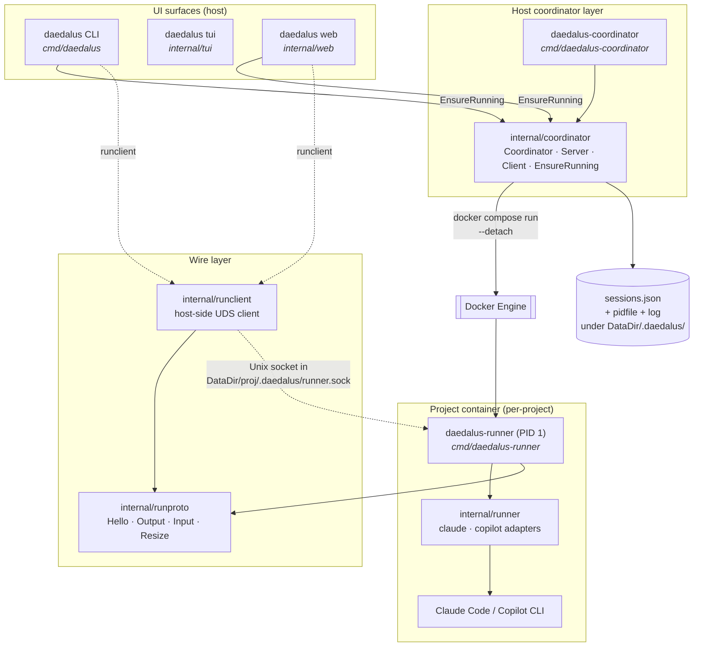
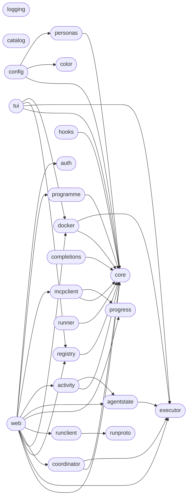
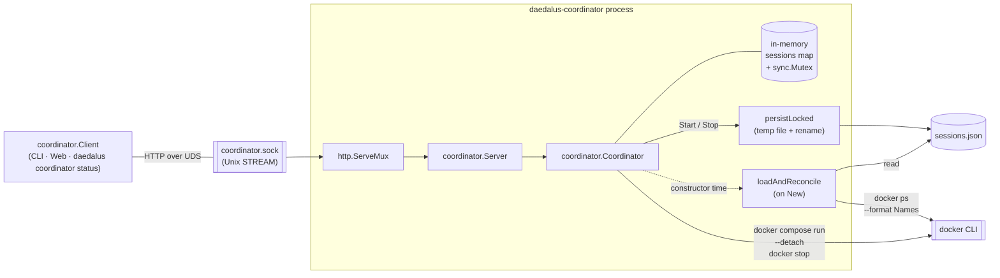

# Architecture

## Overview

Daedalus wraps AI coding agents (Claude Code, Copilot CLI) in Docker containers for autonomous operation. It provides four surfaces (CLI, TUI, Web, daemon) over a shared Go core and a per-container runner process.

The **runner path** is the single launch path — each project runs a `daedalus-runner` PID-1 binary inside its container that fans PTY I/O out over a Unix socket. A host-side `daedalus-coordinator` daemon owns session lifecycles, and all UIs discover sessions through its HTTP-over-UDS API.

## High-level components



Solid edges: coordinator lifecycle control. Dashed edges: PTY I/O relay.

## Modules

### `core/` — pure logic (zero I/O)

| File | Contents |
|---|---|
| `config.go` | `Config` struct, `ValidTargets()`, `IsValidTarget()`, `Image()`, `ContainerName()`, `CacheDir()`, `RunnerSocketPath()`, `SkillsDir()`, `ApplyRegistryEntry()` |
| `appconfig.go` | `AppConfig` (incl. `ContainerPrefix`, `ImagePrefix`), `ApplyAppConfig()` |
| `runner.go` | `HookConfig`, `RunnerProfile`, `LookupRunner()`, `LookupBuiltinRunner()`, `ResolveRunnerName()` |
| `activity.go` | `ActivityState`, `ActivityInfo` — three-state activity model |
| `persona.go` | `PersonaConfig`, `PersonaOverlay`, `PersonasDir()`, `ValidatePersonaName()` |
| `project.go` | `RegistryData`, `ProjectEntry`, `SessionRecord`, `ProjectInfo` |
| `command.go` | `BuildRunnerArgs()`, `BuildExtraArgs()`, `RunnerVolumeArgs()` |
| `skills.go` | `StarterSkills()` — embedded starter skill files |
| `programme.go` | `Programme`, `DependencyEdge`, `DependencyGraph`, `TopologicalSort()`, `DetectCycles()` |
| `sprint.go` | `Sprint`, `SprintItem`, `SprintStatus` — SPRINTS.md data model |
| `backlog.go` | `BacklogItem`, `ParseBacklog()` |
| `roadmap.go` | `ParseSprints()`, `ParseRoadmap()` (legacy alias) |
| `time.go` | `NowUTC()`, `ParseUTC()`, `RelativeTime()` |

### `cmd/` — binaries

| Binary | Purpose |
|---|---|
| `daedalus` | Main CLI. `main.go` dispatches to 15 topic files (`build.go`, `launch.go`, `resolve.go`, `clone.go`, `config_cmd.go`, `usage.go`, `list.go`, `persona.go`, `runners.go`, `programmes.go`, `skills.go`, `coordinator.go`, `attach.go`, `banner.go`). Also owns TUI/Web startup and the runner-attach helper. |
| `daedalus-coordinator` | Host-side daemon. Constructs `coordinator.Coordinator` with `SessionsFile` set, binds `coordinator.NewServer(...)` on the Unix socket, handles SIGINT/SIGTERM for graceful shutdown. |
| `daedalus-runner` | In-container PID-1. Owns the PTY, fans output to any number of connected socket clients, resolves the agent adapter via `internal/runner`. |
| `skill-catalog-mcp` | MCP server (stdio) with 8 tools for skill catalog CRUD. |
| `project-mgmt-mcp` | MCP server (stdio) with 4 tools for project progress / vision / version + roadmap parsers. |
| `generate-manpage` | Emits `daedalus.1` roff man page. |

### `internal/` — I/O boundary packages

| Package | Responsibility |
|---|---|
| `executor` | `Executor` interface + `RealExecutor` + `MockExecutor` (test seam over `os/exec`). |
| `color` | ANSI helpers with `NO_COLOR` support. |
| `config` | CLI argument parsing (`ParseArgs`), `LoadAppConfig`, WSL2 defaults. |
| `registry` | Project registry JSON I/O + migrations + progress rollup. |
| `docker` | Container lifecycle: build, run, compose, running-check. |
| `tui` | Bubbletea + lipgloss dashboard, split by mode (`mode_create.go`, `mode_rename.go`, `mode_confirm.go`) with `commands.go`, `model.go`, `view.go`, `styles.go`. |
| `web` | REST API + WebSocket terminal relays, split by domain (`projects.go`, `dashboard.go`, `roadmap.go`, `programmes.go`, `terminal.go`, `runner_relay.go`). |
| `coordinator` | Host-side runner lifecycle. `Coordinator` (session map + `docker compose run --detach` + socket wait + sessions.json), `Server` (HTTP over UDS), `Client` (Go wrapper), `EnsureRunning` (ssh-agent-style auto-spawn), `DefaultLayout`, `DefaultSocketPath`, `DefaultSessionsFile`. |
| `runproto` | Host↔runner wire protocol: `Hello`, `Output`, `Input`, `Resize` messages with length-prefixed framing. |
| `runclient` | Host-side runner socket client — `Dial`, `Read`, `Write`, `Resize`, `Detach`, hello-scrollback replay. |
| `runner` | Per-agent adapter interface (`claude`, `copilot`) — `Command(LaunchOptions) (bin, args, env)`. Decouples the runner binary from the specific agent it launches. |
| `logging` | Thread-safe file logging with level prefixes. |
| `completions` | bash/zsh/fish shell completion scripts. |
| `personas` | User-defined persona CRUD (JSON overlays). |
| `catalog` | Shared skill catalog operations (filesystem I/O). |
| `progress` | Project progress file I/O (`.daedalus/progress.json`). |
| `programme` | Programme definition CRUD. |
| `mcpclient` | Host-side MCP client for reading project state via bind mounts. |
| `auth` | Token-based Web UI authentication. |
| `activity` | Runner-agnostic activity detection (busy/idle/sleeping). |
| `agentstate` | Agent state observation via Docker inspection. |
| `hooks` | Renders runner-specific `settings.json` from `HookConfig` templates. |
| `platform` | Platform detection (WSL2) and display forwarding argument resolution. |

### Dependency graph



`cmd/daedalus` imports all UI packages plus `coordinator` and `runclient`. `cmd/daedalus-coordinator` imports only `coordinator`, `config`, `executor`. `cmd/daedalus-runner` imports only `runner` and `runproto`. No cycles.

## Runner-attach launch flow

The runner path is the launch path. All UIs use the same flow:

```mermaid
sequenceDiagram
    autonumber
    participant U as User
    participant CLI as daedalus CLI
    participant CT as coordinator.Client
    participant D as daedalus-coordinator<br/>daemon
    participant DK as Docker
    participant R as daedalus-runner<br/>(PID 1)
    participant RC as runclient

    U->>CLI: daedalus alpha
    CLI->>CT: EnsureRunning(DefaultLayout)
    Note over CT,D: Fast path: pidfile alive<br/>+ UDS dialable
    alt Daemon not running
        CT->>D: fork Setsid daedalus-coordinator
        D->>D: bind UDS, load sessions.json,<br/>reconcile via `docker ps`
        CT->>CT: wait for socket
    end
    CLI->>CT: Start(cfg)
    CT->>D: POST /sessions
    D->>DK: docker compose run --detach<br/>DAEDALUS_RUNNER=1
    DK->>R: exec daedalus-runner
    R->>R: bind runner.sock<br/>(bind-mounted host-side)
    D->>D: waitForSocket (30s)
    D->>D: persist sessions.json
    D-->>CT: 201 Session{SocketPath}
    CLI->>RC: Dial(SocketPath)
    RC->>R: TCP-over-UDS<br/>runproto Hello
    R-->>RC: Hello(scrollback, cols, rows)
    Note over RC,R: bidirectional PTY relay<br/>until Ctrl-D
    U->>CLI: Ctrl-D detach
    Note over R: runner keeps running;<br/>daemon still tracks the session
```

The Web UI follows the same shape: `EnsureRunning` → `client.Get(name)` → `runclient.Dial(sess.SocketPath)`. Because `daedalus-runner` fans PTY output out to every connected socket, CLI and Web can attach to the same project simultaneously.

## Coordinator daemon internals



Concurrency: `Server` holds no state; every request funnels through `Coordinator.mu`. Reconciliation runs once at `New`. Every mutating call (`Start`, `Stop`, reconcile) triggers an atomic temp-file-plus-rename write of `sessions.json`.

## Wire protocol: HTTP over UDS

```
POST   /sessions               StartRequest → 201 Session
                                            → 409 ErrAlreadyRunning
                                            → 400 bad body
                                            → 500 other
GET    /sessions                            → 200 []Session (never null)
GET    /sessions/{name}                     → 200 Session
                                            → 404 not tracked
DELETE /sessions/{name}                     → 204
                                            → 404 not tracked
                                            → 500 docker error (session kept)
```

Errors carry a JSON envelope `{"error": "..."}`. `StartRequest` is a deliberate subset of `core.Config` — only the fields `Coordinator.Start` consumes — so future Config changes don't accidentally become part of the wire API.

## Wire protocol: runproto (host ↔ runner)

Length-prefixed messages on the runner's Unix socket.

| Type | Direction | Fields |
|---|---|---|
| `Hello` | runner → host | scrollback (bytes), cols, rows |
| `Output` | runner → host | PTY output bytes |
| `Input` | host → runner | keystrokes / paste |
| `Resize` | host → runner | cols, rows |
| `Detach` | host → runner | (client is going away) |

The runner keeps a scrollback ring buffer per connection so a fresh dial replays recent output before entering live-relay mode. That's what `runclient.Read` surfaces as the first bytes read.

## Container startup (entrypoint.sh)

The container's entrypoint dispatches based on `DAEDALUS_RUNNER`:

- `DAEDALUS_RUNNER=1` → `exec /usr/local/bin/daedalus-runner --adapter $RUNNER --socket $DAEDALUS_SOCKET --workdir /workspace …` (runner path — how Daedalus launches every session)
- otherwise → set up config, then `exec claude` (direct-exec fallback for running the image by hand)

Both dispatches share the same setup:

1. Directory setup — creates `$CLAUDE_CONFIG_DIR`, `/workspace/.claude/skills`, `/workspace/.daedalus`.
2. Config seeding — on first run (no `.claude.json`), copies default config files from `/opt/claude/defaults/`.
3. MCP server reconciliation — ensures Daedalus-specific MCP servers (`skill-catalog`, `project-mgmt`) exist in the live `.claude.json`, preserving user-added servers.

```
defaults/.claude.json          live .claude.json
┌──────────────────┐           ┌──────────────────┐
│ mcpServers:      │           │ mcpServers:      │
│   skill-catalog  │──merge──▶ │   skill-catalog  │  (added if missing)
│   project-mgmt   │           │   project-mgmt   │  (added if missing)
└──────────────────┘           │   notes-mcp      │  (user-added, kept)
                               └──────────────────┘
```

## Bind mounts

```
Host                                    Container (claude-run-<name>)
─────────────────────────────────       ─────────────────────────────
<ProjectDir> ────────(rw)──────────►    /workspace
<DataDir>/<name>/ ───(rw)──────────►    /home/claude          (persistent home)
<DataDir>/<name>/.daedalus/ ─(rw)──►    /home/claude/.daedalus  (runner socket lives here)
<DataDir>/skills/ ───(rw)──────────►    /opt/skills             (shared catalog)
<ProjectDir>/.daedalus/ ─(rw)──────►    /workspace/.daedalus    (progress data)

Baked into image:
                                        /usr/local/bin/daedalus-runner
                                        /usr/local/bin/skill-catalog-mcp
                                        /usr/local/bin/project-mgmt-mcp
```

`<DataDir>` defaults to `<install-dir>/.cache` (set by installer to `~/.local/share/daedalus/.cache`).

Security: non-root user, all capabilities dropped, `no-new-privileges`.

## Protocols and ports

| Protocol | Endpoint | Description |
|---|---|---|
| HTTP | Web UI port (default 3000) | REST + login. `/api/projects/*`, `/api/programmes/*`, `/sprints`, `/backlog`, `/strategic-roadmap` |
| WebSocket | Web UI port | Terminal relay at `/api/projects/{name}/terminal` |
| HTTP over UDS | `<DataDir>/.daedalus/coordinator.sock` | Coordinator daemon API (Start/List/Get/Stop) |
| Unix stream | `<DataDir>/<project>/.daedalus/runner.sock` | daedalus-runner PTY relay |
| Docker API | `/var/run/docker.sock` | Container lifecycle via `docker` CLI |

## Data files under DataDir

```
<DataDir>/
├── projects.json                       # registry (project → dir + target + flags)
├── daedalus.log                        # runtime log
├── skills/                             # shared skill catalog
├── personas/                           # persona configs
├── programmes/                         # programme definitions
├── .daedalus/
│   ├── coordinator.sock                # daemon HTTP-over-UDS listener
│   ├── coordinator.pid                 # daemon pidfile (for start/stop/status)
│   ├── coordinator.log                 # daemon stdout+stderr
│   └── sessions.json                   # persistent runner-session map
└── <project>/                          # per-project cache (= /home/claude in-container)
    ├── .cache/                         # agent's persistent home
    ├── .daedalus/
    │   └── runner.sock                 # per-project daedalus-runner socket
    └── ...                             # session transcripts, config files, etc.
```

## Data flow — where intent turns into containers

1. **CLI / TUI / Web** parse user intent into `core.Config`.
2. **Registry** resolves project name → directory / target / flags.
3. **Docker** package builds the image if missing (autobuild via SHA-256 fingerprint of Dockerfile + entrypoint + compose + settings + claude.json).
4. **Launch** — `coordinator.EnsureRunning` → `client.Start(cfg)` → daemon spawns container + daedalus-runner, tracks session.
5. **Attach** — `runclient` dials the runner socket. Web uses `runnerRelay` over the same socket.
</content>
