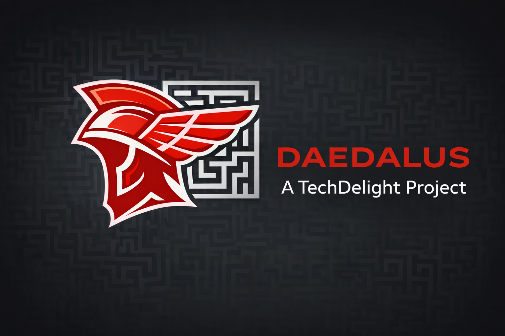

<p align="center">
  
</p>

# Daedalus

A Docker environment for running [Claude Code](https://claude.ai/code) autonomously without permission prompts. The container isolates Claude Code with write access only to the mounted project directory.

## Why

Claude Code is powerful but constantly asks for permission to run commands, edit files, and access tools. Daedalus lets Claude work on your code autonomously — without confirmation prompts — while keeping your system safe by isolating everything inside a locked-down Docker container.

## Quick Start

```bash
# Install Daedalus
curl -fsSL https://raw.githubusercontent.com/techdelight/daedalus/master/install.sh | bash

# Start a project
daedalus my-awesome-app /path/to/project
```

## Installation

The install script downloads the Daedalus source from GitHub, builds the binary via Docker, copies runtime files to a prefix directory, and symlinks `daedalus` into `~/.local/bin`.

**Prerequisites:** curl, Docker (running), and Claude Code credentials (`~/.claude/.credentials.json`).

```bash
# Install to ~/.local/share/daedalus (default)
curl -fsSL https://raw.githubusercontent.com/techdelight/daedalus/master/install.sh | bash

# Install to a custom directory
curl -fsSL https://raw.githubusercontent.com/techdelight/daedalus/master/install.sh | bash -s -- --prefix ~/daedalus
```

**Options:**

| Flag | Description |
|---|---|
| `--prefix <dir>` | Installation directory (default: `~/.local/share/daedalus`) |
| `--no-link` | Skip creating a symlink in PATH |

The symlink is created in `~/.local/bin`. If this directory is not on your PATH, the script prints a hint.

## Usage

```
daedalus [flags] <project-name> [project-dir]
daedalus list
daedalus prune
daedalus remove <name> [name...]
daedalus config <name> [--set key=value] [--unset key]
daedalus tui
daedalus web [--port PORT] [--host HOST]
daedalus completion <bash|zsh|fish>
daedalus --help
```

**Commands:**

| Command | Description |
|---|---|
| `<project-name>` | Open a registered project (uses stored directory) |
| `<project-name> <project-dir>` | Register and open a new project |
| `list` | List all registered projects |
| `prune` | Remove registry entries with missing directories |
| `remove <name> [name...]` | Remove named projects from the registry |
| `config <name>` | View or edit per-project default flags |
| `tui` | Interactive dashboard for managing projects |
| `web` | Web UI dashboard (default: `localhost:3000`) |
| `completion <shell>` | Print shell completion script (bash, zsh, fish) |
| `--help`, `-h` | Show usage message |

**Flags:**

| Flag | Description |
|---|---|
| `--build` | Force rebuild the Docker image |
| `--target <stage>` | Build target: `dev` (default), `godot`, `base`, `utils` |
| `--resume <id>` | Resume a previous Claude session |
| `-p <prompt>` | Run a headless single-prompt task |
| `--no-tmux` | Run without tmux session wrapping |
| `--debug` | Enable Claude Code debug mode |
| `--dind` | Mount Docker socket (WARNING: grants host Docker access) |
| `--force` | Force deletion in non-interactive mode (e.g. prune, remove) |
| `--no-color` | Disable colored output (also honors `NO_COLOR` env var) |
| `--port <port>` | Port for web UI (default: `3000`) |
| `--host <host>` | Host for web UI (default: `127.0.0.1`) |

**Examples:**

```bash
# Open an existing project from the registry
daedalus my-awesome-app

# Register a new project with a directory
daedalus my-awesome-app /path/to/project

# Headless task
daedalus my-awesome-app -p "Fix all linting errors"

# Force rebuild the Docker image
daedalus --build my-awesome-app /path/to/project

# Build a specific target (default: dev)
daedalus --build --target godot my-awesome-app /path/to/project

# Resume a previous session
daedalus --resume <session-id> my-awesome-app

# Run without tmux session wrapping
daedalus --no-tmux my-awesome-app /path/to/project

# Interactive TUI dashboard
daedalus tui

# Web UI dashboard (opens at http://localhost:3000)
daedalus web

# Web UI on a custom port
daedalus web --port 8080

# List all registered projects
daedalus list

# Per-project configuration
daedalus config my-app --set dind=true

# Shell completions
daedalus completion bash

# Show help
daedalus --help
```

## TUI Dashboard

An interactive terminal dashboard for managing all registered projects.

```bash
daedalus tui
```

**Key bindings:** `j`/`↓` move down, `k`/`↑` move up, `s` start (auto-attaches to tmux), `a` attach to running session, `K` kill container, `r` refresh, `q` quit.

The dashboard shows each project's name, running status, build target, and last-used time. Status refreshes automatically every 5 seconds.

## Web UI Dashboard

A browser-based dashboard for managing projects with an embedded terminal.

```bash
daedalus web                    # Start on localhost:3000
daedalus web --port 8080        # Custom port
daedalus web --host 0.0.0.0    # Bind to all interfaces
```

The web UI provides:
- **Project list** with live status (running/stopped), target, and last-used time. Auto-refreshes every 5 seconds.
- **Start/Stop** buttons for each project (launches container in a tmux session).
- **Attach** button that opens an xterm.js terminal in the browser, connected to the tmux session via WebSocket.

**Security:** Binds to `127.0.0.1` by default (localhost only). Use `--host 0.0.0.0` for remote access (add your own authentication layer).

## tmux Controls

Daedalus wraps each container session in tmux. A few essentials:

- **Detach** (leave session running in background): `Ctrl-b` then `d`
- **Scroll up**: `Ctrl-b` then `[` to enter copy mode, then arrow keys or `Page Up`/`Page Down` to scroll. Press `q` to exit copy mode.
- **Reattach**: run `daedalus <project-name>` again — it auto-attaches to the existing tmux session.

## Build Targets

The single `Dockerfile` uses a multi-stage build with four stages:

| Target | Description |
|---|---|
| `base` | Minimal Debian bookworm-slim with Claude CLI, git, and networking tools |
| `utils` | Extends base with unzip, wget, build-essential |
| `dev` (default) | Full dev environment: Go, Python 3, OpenJDK 17, Maven, Kotlin |
| `godot` | Godot 4.x engine for headless game CI, exports, and tests |

Select a target with `--target`:

```bash
daedalus --build --target godot my-game /path/to/game-project
```

## Authentication

Credentials are bind-mounted read-only from the host at runtime. No credentials are copied into the build context or baked into the image.

### Refreshing Expired Credentials

Claude tokens expire periodically. When a running agent starts failing with authentication errors, re-authenticate from a separate terminal on the host:

```bash
# In a separate shell on the host (not inside the container)
claude /login
```

The credentials file (`~/.claude/.credentials.json`) is updated on the host. Since the container bind-mounts this file read-only, the running agent picks up the new token automatically — no restart or rebuild required.

## Project Registry

Projects are tracked in `.cache/projects.json` with metadata (directory, target, timestamps). On first run, existing `.cache/*/` directories are auto-migrated into the registry.

When starting with a project name that isn't registered:
- **Interactive mode** — prompts to create a new project or abort
- **Headless mode** (piped stdin or `-p` flag) — auto-registers the project silently

Use `daedalus list` to see all registered projects with their directories, targets, and last-used timestamps.

Each container is named `claude-run-<project-name>`. If a container with that name is already running, `daedalus` exits with an error instead of starting a second instance.

## Home Directory Persistence

Container home directories are persisted across runs via `.cache/<project-name>/` on the host, bind-mounted as `/home/claude`. This preserves shell history, tool caches, and session state between container restarts.

Session transcripts survive container removal, enabling `--resume` to work across runs:

```bash
# Run a session, note the session ID, then exit
daedalus my-app /path/to/project

# Resume that session later
daedalus --resume <session-id> my-app
```

## Configuration File

A default `config.json` is installed next to the binary. Edit it to customize settings that would otherwise require CLI flags or environment variables.

**Location:** `<install-dir>/config.json` (default: `~/.local/share/daedalus/config.json`)

**Precedence:** CLI flags > environment variables > config file > built-in defaults

```json
{
  "data-dir": "/mnt/data/daedalus",
  "debug": true,
  "no-tmux": false,
  "image-prefix": "custom/claude-runner"
}
```

All fields are optional. The file itself is optional — Daedalus works without it. An empty `{}` is valid.

| Key | Type | Description |
|---|---|---|
| `data-dir` | string | Base directory for registry and per-project caches. Must be an absolute path. Set during installation to `<install-dir>/.cache`. |
| `debug` | bool | Enable Claude Code debug mode |
| `no-tmux` | bool | Run without tmux session wrapping |
| `image-prefix` | string | Docker image prefix (default: `techdelight/claude-runner`) |

## Environment Variables

| Variable | Default | Description |
|---|---|---|
| `CLAUDE_CONFIG_DIR` | `~/.claude` | Host path to Claude credentials |
| `DAEDALUS_DATA_DIR` | `.cache` next to binary | Base directory for registry and per-project caches |
| `NO_COLOR` | (unset) | Disable colored output when set |

## Security Model

- Runs as non-root `claude` user (UID matched to caller)
- All Linux capabilities dropped
- `no-new-privileges` prevents privilege escalation
- Credentials bind-mounted read-only at runtime

## Requirements

- Docker and Docker Compose
- Claude Code CLI logged in on the host (`~/.claude/.credentials.json` must exist)
- (Optional) `tmux` for detach/reattach support

## Contributing

See [CONTRIBUTING.md](CONTRIBUTING.md) for build instructions, development workflow, and technical details. See [ARCHITECTURE.md](ARCHITECTURE.md) for system design.

## License

Apache-2.0 — see [LICENSE](LICENSE) for details.
