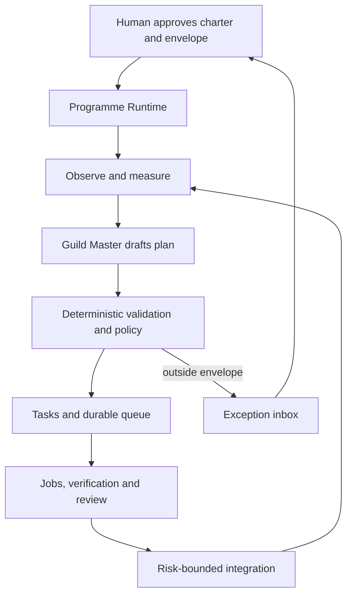

# Daedalus Programme Runtime Migration

**Status:** Proposed architecture and implementation path  
**Baseline:** `development` at `14525aec` (2026-08-26)  
**Objective:** Restructure Daedalus from a governed agent-execution control plane with programme labels into a system that can autonomously pursue measurable programme outcomes with minimal routine user intervention.

## 1. Executive decision

Daedalus should not achieve autonomy by granting the Guild Master human authority. It should achieve autonomy by letting a human approve a **Programme Charter** and a bounded **Delegation Envelope** once.

Inside that envelope, Daedalus may autonomously:

- observe programme and project state;
- identify gaps between desired outcomes and current evidence;
- create Tasks;
- schedule and dispatch Jobs;
- retry or refine bounded failures;
- run independent verification and review;
- integrate low-risk accepted changes;
- measure programme benefits;
- replan within the approved intent and limits;
- pause when it cannot continue safely.

The user is interrupted only when Daedalus needs to:

- change the programme's intended outcome;
- widen money, time, attempt, concurrency or risk limits;
- weaken an acceptance condition;
- perform an irreversible or externally consequential action;
- cross a protected security boundary;
- resolve a conflict between programmes or human priorities;
- accept that a programme failed to realise its benefit;
- continue after repeated failure or exhausted policy.

This changes the human role from **approver of individual operations** to **owner of intent, limits and exceptions**.

## 2. Target operating model



The Guild Master supplies reasoning and initiative. It does not own authority, scheduling, verification, integration or programme completion. Those remain host-side responsibilities.

## 3. What must remain unchanged

The existing control-plane work contains the right foundations and should be extended rather than rewritten:

- `Task → Job → Artifact` remains the execution lineage.
- Worker output remains a claim, never its own verdict.
- Acceptance policy and integration targets remain plane-owned.
- Verification remains independent of the worker.
- Project-controlled documents remain untrusted input.
- The Guild Master never receives `control.sock` or `coordinator.sock`.
- Project repositories remain read-only to the Guild Master.
- Integration remains a transactional rebase, merged-result verification and compare-and-swap operation.
- Event history remains append-only and authoritative.
- Runtime side effects remain idempotent and reconcilable.

Autonomy must be built by granting narrow authority to specific programme actions, not by eroding these guarantees.

## 4. Current gaps

### 4.1 Programme is descriptive, not accountable

The current `Programme` records a name, description, projects and declared project dependencies. It has no:

- measurable benefit;
- baseline or target;
- accountable owner;
- review cadence;
- lifecycle;
- tranche or decision boundary;
- budget envelope;
- completion rule.

Its status is a Task roll-up. It can report that every Task landed, but cannot report that the programme failed.

### 4.2 The Guild Master has no autonomous control loop

The Guild Master notices only when a user launches it. It has no durable planning cycle, no periodic trigger, no first-class Observation, and no reliable feedback loop over proposals it submitted.

### 4.3 The scheduler does not schedule autonomously

Capacity waiters live in memory. A caller must retry dispatch. Restarting the daemon forgets the queue. Free capacity does not automatically wake and dispatch the oldest eligible Task.

Programme-aware fairness cannot safely sit on top of this.

### 4.4 Authority is safe but too coarse for autonomy

The current distinction is caller class: `human` or `agent`. Consequential agent operations become proposals requiring confirmation. This is safe, but it turns the user into a mechanical approval button.

Daedalus needs a third answer:

> This agent may perform this action, against these resources, until this limit, because a human approved this programme envelope.

### 4.5 Programme output is confused with programme outcome

Verification and review can assess whether an Artifact meets a Task's request. Neither establishes whether the programme produced its intended benefit.

### 4.6 Human work is not first-class

A Task points to a project and a Job runs an agent. Humans may create, approve and inspect work, but cannot be assigned a Work Item, accept it, decline it or attach evidence of completion.

This is not required for the first autonomous software-programme release, but the data model must leave room for it.

### 4.7 Capability definitions are scattered

Authority tiers, legal states, daemon routes, CLI commands, MCP tools, UI actions and refusal remedies are maintained in different places. This has repeatedly produced capabilities available in the plane but missing from the agent surface or role document.

Autonomy magnifies that defect: an automated controller cannot safely act when the system itself cannot derive which action is legal and reachable.

## 5. Programme semantics

### 5.1 Definition

A Daedalus Programme is:

> A temporary, governed coordination of projects and activities intended to realise a measurable outcome or benefit that the components cannot deliver independently.

Programmes coordinate outcomes. Projects produce capabilities. Tasks produce deliverables. Jobs attempt Tasks. Artifacts record results.

### 5.2 Programme Charter

Introduce a versioned `ProgrammeCharter` owned by the control plane.

```go
type ProgrammeCharter struct {
    ID              string
    ProgrammeID     string
    Version         int
    Purpose         string
    OwnerPrincipal  string
    Projects        []string
    Outcomes        []OutcomeDefinition
    Constraints     []Constraint
    Envelope        DelegationEnvelope
    ReviewCadence   Duration
    ReviewAt        time.Time
    Deadline        *time.Time
    ActivatedAt     *time.Time
    Supersedes      string
}
```

An activated Charter is immutable. Amending one creates a new version and requires human authorization. Existing Tasks retain the Charter version under which they were created.

### 5.3 Outcome and benefit definitions

```go
type OutcomeDefinition struct {
    ID              string
    Statement       string
    Measure         MeasureDefinition
    Baseline        Value
    Target          Value
    CheckCadence    Duration
    Mandatory       bool
}

type MeasureDefinition struct {
    Kind            string // command, HTTP probe, metric, MCP tool, human attestation
    Source          string
    Query           string
    Aggregation     string
    StabilityWindow Duration
}
```

Programme completion requires evidence against mandatory outcomes. “Every Task landed” is never itself a benefit measure.

### 5.4 Programme lifecycle

```text
draft
  → awaiting_activation
  → active
      ↔ paused
      ↔ at_risk
      → benefit_review
          → completed
          → active        (benefit not yet realised; replan)
          → terminated    (benefit abandoned or no longer justified)
```

Only a human may activate a Charter, approve an intent-changing amendment, or accept termination for strategic reasons. The runtime may automatically pause, mark `at_risk`, enter benefit review and complete a programme when its approved completion rule is entirely machine-verifiable.

### 5.5 Tranches

Add `ProgrammeTranche` as the programme's bounded planning horizon.

```go
type ProgrammeTranche struct {
    ID              string
    ProgrammeID     string
    CharterVersion  int
    Name            string
    Objective       string
    EntryCriteria   []Criterion
    ExitCriteria    []Criterion
    Budget          Budget
    State           TrancheState
    Sequence        int
}
```

A tranche is where authority is renewed and benefits are reassessed. It is not a milestone. Project milestones remain roadmap markers owned by their projects.

## 6. Delegated authority

### 6.1 Replace repeated approval with an envelope

Introduce a plane-owned `DelegationEnvelope` approved with the Charter.

```go
type DelegationEnvelope struct {
    Projects             []string
    AllowedActions       []Operation
    MaximumBudget        Budget
    MaximumTaskRisk      RiskClass
    MaximumAttempts      int
    MaximumRefinements   int
    MaximumReplans       int
    ProtectedPaths       []string
    AllowAutoIntegration bool
    ExpiresAt            time.Time
}
```

The envelope narrows host and project policy. It can never widen either.

### 6.2 Non-delegable operations

The following remain human-only:

- activate, amend or terminate a Programme Charter;
- change an outcome, baseline, target or benefit measure;
- widen a budget or autonomy envelope;
- weaken acceptance checks or protected-path policy;
- grant access to credentials, external networks or private data;
- authorize destructive external side effects;
- override a failed independent verdict;
- resolve a conflict between programme priorities;
- approve work exceeding the programme's risk class.

These are not proposal-tier because the agent should not be able to compose a command that becomes valid merely when a tired human clicks Confirm. The human should be shown the decision and evidence, then construct or select the permitted amendment.

### 6.3 Recommended balanced-autonomy matrix

| Action | Automatic inside envelope | Escalate when |
|---|---|---|
| Observe projects and plane state | Yes | Never for ordinary reads |
| Record an Observation | Yes | Observation requests protected information |
| Create a Task | Yes | No outcome contribution or project outside Charter |
| Add Task dependency | Yes, if same programme, acyclic and policy-valid | Cross-programme edge or priority conflict |
| Dispatch | Yes | Budget, capacity or risk limit exceeded |
| Verify and review | Yes | Required verifier unavailable repeatedly |
| Retry | Yes, within attempt and failure-class policy | Same failure repeats or attempts exhausted |
| Refine from review | Yes, bounded | Review asks for intent change or protected work |
| Replan | Yes, within the same outcome and tranche | Objective or benefit changes |
| Cancel queued/unstarted work | Yes | Cancellation discards accepted or externally visible work |
| Stop a running Job | Yes | Termination cannot be confirmed |
| Integrate | Yes for low-risk, independently accepted work | Protected paths, migrations, credentials or high risk |
| Complete programme | Yes when all mandatory measures are objective | Any mandatory measure needs human attestation |

### 6.4 Central authorization decision

Replace scattered `TierFor` decisions with one richer decision while keeping caller transport identity as an input:

```go
Authorize(Principal, Operation, Resource, Context) Decision

Decision {
    Result: allow | propose | refuse | require_human
    GrantID
    Reason
    Limits
    EvidenceRequired
}
```

Hard invariants remain code, not policy. The authorization engine may narrow them but never override them.

## 7. One operation registry

Create a single registry for every operation:

```go
type OperationDescriptor struct {
    Name              Operation
    Mutating          bool
    LegalTaskStates   []State
    DefaultAgentTier  Tier
    Risk              RiskClass
    RequiredEvidence  []EvidenceKind
    Remedies          []Operation
    HumanRoute        string
    AgentTool         string
}
```

Derive from this registry:

- state guards;
- authority-table completeness tests;
- refusal remedies;
- daemon route coverage;
- agent MCP capability documentation;
- Guild Master role documentation;
- Ledger action availability;
- CLI help and documentation checks.

This work should precede autonomous action. Otherwise Daedalus will automate the existing surface-drift problem.

## 8. Durable programme runtime

### 8.1 Durable queue

Replace the scheduler's in-memory waiting map with plane state:

```text
queue_entries
  task_id
  programme_id
  tranche_id
  priority
  eligible_at
  queued_at
  lease_owner
  lease_until
  refusal_reason
```

The scheduler must:

- persist order across restart;
- wake on capacity and state changes;
- dispatch eligible Tasks without caller polling;
- enforce global, project and programme limits;
- use leases so crashed dispatchers do not strand work;
- prevent starvation;
- remain deterministic for a given state snapshot;
- record why a higher-priority Task did not run.

Programme priority and fairness are policy over this durable queue, never over an in-memory hint.

### 8.2 Real termination

Every running Job needs a durable execution handle with idempotent `Stop` and `Kill` operations. A timeout or cancellation is incomplete until the runner confirms termination or the plane records an unresolved physical process.

No capacity lease may be released merely because SQLite says `failed` while the container remains alive.

### 8.3 Event-driven reconciliation

The Programme Runtime should wake on:

- programme activation;
- Task, Job, Artifact, Review or Proposal events;
- queue capacity changes;
- scheduled measure checks;
- Charter review dates;
- expiring budgets or grants;
- new project Observations;
- a low-frequency heartbeat for recovery.

Do not run the Guild Master continuously. Wake it when deterministic code concludes that planning judgement is required.

## 9. Autonomous programme loop

### 9.1 The loop

For each active Programme:

1. Load the active Charter, current tranche, budget and delegation envelope.
2. Reconcile physical execution with plane state.
3. Evaluate current benefit measurements.
4. Compare the programme declaration, Task graph and project roadmaps.
5. Detect missing work, drift, blockers, duplicate work and stale assumptions.
6. Ask the Guild Master for a structured `PlanProposal` only when judgement is needed.
7. Validate every proposed Task and dependency deterministically.
8. Materialize allowed Tasks and queue entries.
9. Dispatch eligible work automatically.
10. Verify, review, refine and integrate within policy.
11. Re-measure outcomes.
12. Continue, open the next tranche, complete, pause or escalate.

### 9.2 Structured planning output

The Guild Master must produce data, not executable instructions:

```go
type PlanProposal struct {
    ProgrammeID    string
    CharterVersion int
    TrancheID      string
    Observations   []ObservationDraft
    Tasks          []TaskDraft
    Dependencies   []DependencyDraft
    ReplanReason   string
    Confidence     float64
}
```

It cannot provide shell commands, host paths, container configuration, acceptance policy or integration targets. The plane resolves all execution details.

### 9.3 Stall detection

The runtime should treat a programme as stalled when one or more conditions hold:

- no outcome measurement improves during the configured stability window;
- the same failure class repeats across bounded attempts;
- open work has no runnable Tasks;
- the declared and enforcing graphs remain divergent past policy;
- required projects have no current evidence;
- budget consumption rises without accepted output;
- every remaining action lies outside the envelope.

A stall first triggers bounded replanning. Repeated stalls move the programme to `at_risk` and create one exception for the user containing evidence and choices.

## 10. Observations and feedback

Add a first-class `Observation`:

```go
type Observation struct {
    ID             string
    ProgrammeID    string
    Project        string
    Finding        string
    Evidence       []EvidenceRef
    SuggestedReply string
    State          open | adopted | rejected | superseded | expired
    Response       string
    CreatedBy      PrincipalID
    CreatedAt      time.Time
    ExpiresAt      time.Time
}
```

An Observation:

- gates nothing;
- may be created automatically;
- is answered by the receiving project or human;
- remains visible until answered or expired;
- can lead to a Task only through the programme loop and policy check;
- supplies measurable feedback about whether the Guild Master is useful.

Also expose proposal status to the Guild Master. An automated planner that can ask but cannot learn the answer is not autonomous; it is merely unattended.

## 11. Benefit measurement and completion

### 11.1 Independent measure runner

Add a `MeasureRunner` analogous to the verifier. It evaluates a Charter's measures from sources outside the worker's control where practical.

Supported measure types should be introduced incrementally:

1. command or test result;
2. repository or control-plane query;
3. HTTP health or behaviour probe;
4. MCP tool query against an authoritative service;
5. metric query;
6. explicit human attestation.

### 11.2 Evidence

Every measurement produces a durable record:

```go
type BenefitMeasurement struct {
    ProgrammeID    string
    CharterVersion int
    OutcomeID      string
    Value          Value
    Source         string
    Evidence       []EvidenceRef
    MeasuredAt     time.Time
    Verdict        below | met | exceeded | unavailable
}
```

### 11.3 Completion rule

A programme may complete automatically only when:

- every mandatory outcome meets its target;
- every target remains met for its stability window;
- no mandatory measure is unavailable;
- no unresolved high-risk Observation or integration remains;
- the completion rule in the activated Charter permits automatic completion.

Otherwise Daedalus enters `benefit_review` and asks the user one decision, supported by the complete evidence pack.

## 12. Risk-bounded automatic integration

Minimal interaction is impossible if every successful Task still needs a confirmation click. Automatic integration must therefore be allowed, but only under project and programme policy.

### 12.1 Risk classification

Classify a candidate using deterministic facts:

- files and protected paths changed;
- migration or schema changes;
- authentication, authorization or credential code;
- infrastructure and deployment definitions;
- network or external side effects;
- dependency changes;
- diff size and component count;
- verification and reviewer evidence;
- history of flaky or failed checks.

The LLM may explain risk but may not assign its own authoritative class.

### 12.2 Auto-integration conditions

Allow automatic integration only when:

- the Charter and project policy both permit it;
- the candidate is within the permitted risk class;
- frozen verification passed;
- the independent reviewer found no blocking issue;
- protected paths were untouched;
- dependency and programme gates are satisfied;
- the integration transaction succeeds against the current target;
- the merged result passes verification again.

Every other candidate enters one exception queue with its evidence pack.

## 13. Human and hybrid work

Do not force human work into `Job`. Introduce a parent `WorkItem` only after the autonomous agent path is stable:

```go
type WorkItem struct {
    ID             string
    ProgrammeID    string
    TrancheID      string
    Objective      string
    Contribution   string
    ExecutorKind   agent | human | hybrid | external
    Assignee       PrincipalID
    State          WorkItemState
    EvidencePolicy EvidencePolicy
}
```

Agent Work Items spawn Tasks and Jobs. Human Work Items support:

- assignment and acknowledgement;
- acceptance or early decline of the work package;
- due dates and reminders;
- evidence links or attachments;
- review and acceptance;
- escalation when blocked.

This is a later milestone. The first autonomous release should remain honest: it automates Git-native agent work and asks humans only for programme decisions and unavoidable human activities.

## 14. User experience for minimal intervention

### 14.1 Programme activation

The user should make one structured activation decision:

- Is this outcome worth pursuing?
- Are the measures credible?
- Which projects may participate?
- What budget and risk may Daedalus consume?
- Which actions may be automatic?
- When should the programme return for review?

### 14.2 Exception inbox

Replace routine proposal approval with a small exception inbox. Each item must state:

- what Daedalus attempted;
- why policy stopped it;
- what evidence exists;
- cost and risk of each available choice;
- what happens if the user does nothing;
- the exact decision required.

Do not show the user an operation-shaped prompt when the real question is strategic.

### 14.3 Digests

Normal progress should be delivered as a periodic digest:

- outcome movement;
- accepted work;
- budget consumed and remaining;
- replans and their reasons;
- new risks or observations;
- the next action Daedalus expects to take.

The digest is informational. It does not require acknowledgement.

### 14.4 Kill switch

Every programme needs an immediate host-side pause that:

- stops new dispatch;
- requests termination of running Jobs according to policy;
- preserves worktrees and evidence;
- revokes active delegation grants;
- records the operator action.

## 15. Incremental migration path

### Milestone 23 — Programme truth

**Goal:** Make a Programme an accountable outcome contract without changing execution behaviour.

Deliverables:

- `ProgrammeCharter`, `OutcomeDefinition`, `BenefitMeasurement` and lifecycle tables;
- additive SQLite migrations;
- manual CLI/API paths to draft, activate, inspect, pause and review a Charter;
- programme view showing outcome, baseline, target and current evidence;
- legacy programmes remain readable;
- Tasks record the active Charter version;
- project roadmaps remain separate and project-owned.

Exit gate:

> A human can define PR-2's learner outcome, baseline and target; Daedalus can report whether the benefit is met independently of Task completion.

### Milestone 24 — One capability and policy model

**Goal:** Make legality, authority and remedies derivable before increasing autonomy.

Deliverables:

- central `OperationDescriptor` registry;
- authorization decision API;
- `DelegationEnvelope` and durable Grant records;
- generated or exhaustively tested parity across daemon, CLI, MCP, Ledger and role docs;
- refusal remedies derived from legal operations;
- separate `require_human` from ordinary agent proposal.

Exit gate:

> For every operation and state, one authoritative query explains whether it is allowed, proposed, refused or escalated, and every exposed surface agrees.

### Milestone 25 — Durable execution runtime

**Goal:** Make unattended execution survive restarts and enforce its own limits physically.

Deliverables:

- persistent queue and leases;
- automatic dispatch on capacity;
- programme/project/global fairness policy;
- durable execution handles;
- confirmed stop/kill semantics;
- reconciliation of queue, Job and container state;
- restart, duplicate-event and crash-boundary tests.

Exit gate:

> A queued Task runs when capacity appears without user polling, survives daemon restart in the same order, and a timed-out Job is confirmed dead before capacity is released.

### Milestone 26 — Autonomous programme loop

**Goal:** Let an active Programme plan and execute bounded work without routine approval.

Deliverables:

- event-driven Programme Runtime;
- structured `PlanProposal` from the Guild Master;
- deterministic validation and Task materialization;
- automatic bounded dispatch, retry, verification and review;
- first-class Observations and responses;
- proposal-status visibility for the Guild Master;
- stall detection, bounded replanning and evidence-rich escalation.

Exit gate:

> In Observe mode and then Execute mode, PR-6 can detect an undocumented project, create policy-valid remediation work, dispatch it, verify it and report the result without a user clicking through the ordinary lifecycle.

### Milestone 27 — Governed automatic integration

**Goal:** Remove the routine human landing gate for demonstrably low-risk work.

Deliverables:

- deterministic risk classifier;
- protected-path and project autoland policies;
- Charter-level automatic-integration permission;
- evidence pack for every automatic landing;
- merged-result verification remains mandatory;
- exception path for all non-low-risk work.

Exit gate:

> A low-risk documentation or isolated code correction can move from planned to integrated without human action, while a credentials, migration or protected-path change reliably stops for review.

### Milestone 28 — Benefit realisation

**Goal:** Let Daedalus steer toward and close on outcomes rather than completed Tasks.

Deliverables:

- `MeasureRunner` with command, plane-query and MCP-query sources;
- scheduled and event-triggered measurements;
- tranche entry and exit evaluation;
- benefit stability windows;
- automatic completion when fully objective and authorized;
- human attestation path for subjective outcomes;
- programme benefit trends and final evidence report.

Exit gate:

> PR-2 remains active after its code lands until the defined end-to-end Hebrew-learning journey passes its benefit measure; it then completes from evidence, not from an empty Task queue.

### Milestone 29 — Human and external work

**Goal:** Extend programme coordination beyond agent-executed Git work without corrupting the Job model.

Deliverables:

- `Principal` and `WorkItem` models;
- human assignment, acknowledgement, decline and evidence;
- external-system action adapters with separate risk policies;
- reminders and exception escalation;
- audit attribution beyond the coarse caller class.

Exit gate:

> One programme can coordinate an agent-delivered code change and a human-delivered publication or administrative action while preserving distinct evidence and authority rules.

## 16. Autonomy rollout modes

Each Programme should move through explicit modes:

| Mode | Behaviour |
|---|---|
| `observe` | Measure, compare and record Observations; no Tasks created |
| `recommend` | Draft Tasks and actions as proposals; current safety posture |
| `execute` | Create, queue, dispatch, retry, verify and review inside envelope; no automatic integration |
| `governed_autonomy` | Integrate low-risk accepted work automatically |
| `outcome_autonomy` | Replan, open tranches, measure benefits and complete automatically where objective |

Promotion between modes is a human decision. Demotion and pause may happen automatically on policy breach, repeated failure or unavailable evidence.

## 17. Existing data migration

### 17.1 Database migration

Use additive migrations only:

1. Add Charter, outcome, measurement, tranche, grant, queue and Observation tables.
2. Add nullable `charter_version` and `tranche_id` to Tasks.
3. Create one generated draft Charter for every existing Programme.
4. Mark generated Charters `legacy_unapproved`; they grant no new autonomy.
5. Preserve every Programme ID, Task reference and event.
6. Existing APIs continue to render the Programme's current name, description, projects and dependency graph.

### 17.2 Current programme migration

Apply the separate restructuring decision:

- PR-2, PR-3, PR-5, PR-6 and PR-7 receive reviewed Charters and outcome measures.
- PR-1 and PR-4 are retired as programmes and continue as project-level work.
- PR-8 is marked merged into PR-3; new work uses PR-3.
- Historical Tasks keep their original Programme IDs.
- No programme receives automatic authority until its Charter and envelope are explicitly activated.

### 17.3 Compatibility period

For at least one release:

- a legacy Programme may exist without an activated Charter;
- it remains readable and may receive human-created Tasks;
- it cannot enter autonomous modes;
- CLI and Ledger clearly distinguish `legacy`, `draft`, `active` and `retired`.

## 18. Testing strategy

### 18.1 Deterministic simulation

Build a fake clock, fake runner, fake verifier, fake reviewer and fake measure source. A complete programme must be replayable from an event stream without Docker or an LLM.

### 18.2 Required failure tests

- daemon crash before and after every durable state transition;
- duplicated event delivery;
- abandoned queue lease;
- unkillable runner;
- capacity released while an older Task waits;
- poisoned project document asking for an outside-envelope action;
- Guild Master inventing a project, programme or benefit measure;
- agent attempting to amend its own Charter or budget;
- verifier unavailable versus verifier failure;
- review loop consuming its maximum refinements;
- integration target moving during automatic landing;
- benefit source unavailable;
- all Tasks complete while benefit remains below target;
- automatic completion with one subjective mandatory measure;
- programme pause and grant revocation during running work.

### 18.3 Dogfooding sequence

Use real programmes in increasing danger order:

1. **PR-6 in `observe` mode:** compare documentation and dashboard truth.
2. **PR-6 in `execute` mode:** file and verify low-risk documentation remediation.
3. **PR-2 in `execute` mode:** coordinate integration work without autoland.
4. **PR-2 in `governed_autonomy`:** autoland only low-risk accepted changes.
5. **PR-3 in `outcome_autonomy`:** pursue a complete assistant journey with measurable probes.

Do not begin with Daedalus automatically modifying its own authority model. Self-modification is the final test, not the tutorial.

## 19. Success metrics for the migration

The migration succeeds when:

- routine dispatch, verify, review, retry and low-risk integration require no user clicks;
- at least 90% of ordinary Task lifecycle transitions occur autonomously;
- fewer than one user exception is raised per ten accepted Tasks;
- every exception names the evidence, decision and consequence of inaction;
- daemon restart does not lose runnable work, order or programme state;
- no Job exceeds a terminal transition while still running unnoticed;
- every active Programme has a measurable outcome, baseline, target and review date;
- a Programme can remain incomplete after all planned Tasks land;
- a Programme can complete from measured benefit without a ceremonial final click when its Charter permits it;
- the Guild Master's Observation adoption, rejection and expiry rates are measurable;
- no automatic action can widen its own envelope or weaken its own oracle.

## 20. Explicit non-goals

Do not include these in the first autonomous programme release:

- generic Jira-style project management;
- arbitrary multi-user SaaS support;
- automatic modification of Programme Charters;
- automatic acceptance of subjective benefits;
- automatic credentials or network grants;
- automatic weakening of acceptance checks;
- unbounded retries, replans or reviewer loops;
- cross-programme resource optimization before the durable scheduler is proven;
- making project roadmaps authoritative control-plane state;
- allowing the Guild Master to write another project's roadmap;
- treating LLM confidence as authorization evidence.

## 21. Recommended immediate next step

Do not start with another Guild Master tool.

Start Milestone 23 with three concrete slices:

1. Add a versioned Programme Charter and lifecycle without changing current execution.
2. Give PR-6 one machine-checkable outcome using its existing 7-of-19 and 4-of-19 baseline.
3. Render Task completion and programme benefit separately in the Ledger.

That proves the semantic distinction on which every later autonomy feature depends. Only then centralize operation policy, persist the scheduler and allow the runtime to act without repeated confirmation.

The cynical warning is simple: if Daedalus automates before it can distinguish **work completed** from **benefit realised**, it will become extremely efficient at finishing the wrong programme.
